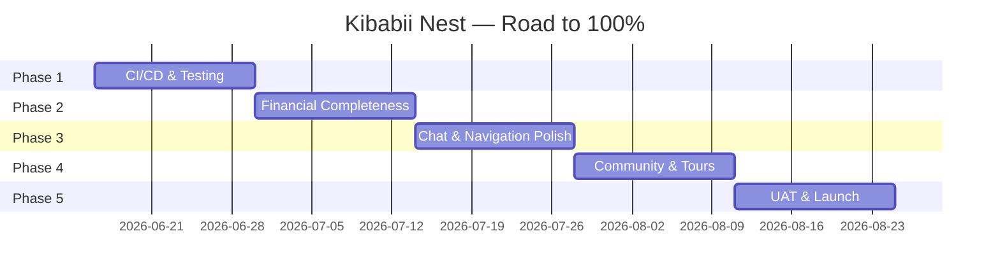

# Kibabii Nest — Full Platform Audit & Roadmap to 100%

**Date:** June 12, 2026  
**Auditor:** Antigravity AI  
**Commit:** `8c97c07` (main)

---

## Executive Summary

Kibabii Nest is a **multi-tenant student housing platform** serving Kibabii University. It consists of three codebases:

| Layer | Stack | Status |
|---|---|---|
| **Backend** | NestJS + Prisma + PostgreSQL | ~78% complete |
| **Frontend Web** | Next.js (Landlord/Admin dashboards) | ~70% complete |
| **Mobile App** | Flutter + Riverpod (Student-facing) | ~72% complete |
| **DevOps** | Docker Compose + Netlify | ~60% complete |

> **Overall Platform Completion: ~70%**

---

## Module-by-Module Audit

### 1. Authentication & Identity (85% ✅)

| Feature | Backend | Frontend | Mobile | Status |
|---|---|---|---|---|
| Email/Password Registration | ✅ | ✅ | ✅ | Done |
| JWT + httpOnly Cookies | ✅ | ✅ | ✅ | Done |
| Google OAuth | ✅ | ✅ | ✅ | Done |
| 2FA Toggle (UI only) | ✅ | — | ✅ | UI Done, no OTP flow |
| Student ID Scan (AI OCR) | ✅ | — | ✅ | Done |
| Password Reset Flow | ✅ | ⚠️ Partial | ❌ | **Gap: no mobile reset** |
| Role-based Guards | ✅ | ✅ | ✅ | Done |

> [!WARNING]
> **2FA** is toggled on the profile but no actual OTP delivery (SMS/email) is implemented. Password reset is missing on mobile.

---

### 2. Property Discovery & Listings (82% ✅)

| Feature | Backend | Frontend | Mobile | Status |
|---|---|---|---|---|
| Property CRUD | ✅ | ✅ | ✅ (view only) | Done |
| Image Upload (S3/MinIO) | ✅ | ✅ | ✅ | Done |
| Video Tour URLs | ✅ | ✅ | ✅ | Done |
| Property Search/Filter | ✅ | ✅ | ✅ | Done |
| Category/Taxonomy | ✅ | ✅ | — | Admin-only |
| Property Verification Queue | ✅ | ✅ | ✅ (landlord) | Done |
| Map Explorer (Mapbox) | ✅ | — | ✅ | Done |
| Favorites / Save | ✅ | — | ✅ | Done |
| Property Detail Deep View | — | ✅ | ✅ | Done |
| Amenity/Rules/Services Mgmt | ✅ | ✅ | ✅ (view) | Done |
| Extra Charges Config | ✅ | ✅ | ✅ (view) | Done |
| Unit Types & Pricing | ✅ | ✅ | ✅ | Done |
| Open Days | ✅ | ⚠️ Partial | ❌ | **Gap: no mobile open days** |

---

### 3. Booking & Tenancy (75% ✅)

| Feature | Backend | Frontend | Mobile | Status |
|---|---|---|---|---|
| Booking Request | ✅ | ✅ | ✅ | Done |
| Booking Approval/Rejection | ✅ | ✅ | ✅ (landlord) | Done |
| Tenancy Creation (from booking) | ✅ | ✅ | ✅ | Done |
| Tenancy Dashboard | ✅ | ✅ | ✅ | Done |
| Vacation Notice (30-day) | ✅ | ✅ | ✅ | Done |
| Digital Agreement Signing | ✅ | ⚠️ | ✅ | Partially integrated |
| Break Period / Semester Hold | ✅ (schema) | ❌ | ❌ | **Gap: no UI** |
| Unit Availability Tracking | ✅ | ⚠️ | ⚠️ | Auto-calc partial |
| Multi-month Booking | ✅ | ✅ | ✅ | Done |

> [!IMPORTANT]
> **Break Period** logic exists in the schema (`breakPeriodEnabled`, `breakPeriodRentPct`, `breakPeriodStart/End`) but has **zero frontend or mobile UI**. This is a key differentiator feature for semester-based housing.

---

### 4. Payments & Finance (68% ✅)

| Feature | Backend | Frontend | Mobile | Status |
|---|---|---|---|---|
| M-Pesa STK Push | ✅ | — | ✅ | Done |
| M-Pesa Callback Handling | ✅ | — | ✅ | Done |
| Monthly Auto-Payment Generation | ✅ (cron) | — | — | Backend only |
| Payment Reminders (email) | ✅ (cron) | — | — | Backend only |
| Overdue Detection & Penalties | ✅ (cron) | — | — | Backend only |
| Receipt Upload & AI Verification | ✅ | ✅ | ✅ | Done |
| Payment History | ✅ | ✅ | ✅ | Done |
| Upfront Discount | ✅ | ✅ | ✅ | Done |
| Landlord Financial Dashboard | ✅ | ✅ | ✅ | Done |
| Admin Financial Oversight | ✅ | ✅ | — | Web-only |
| Wallet System | ✅ | ⚠️ | ✅ | Done |
| Withdrawal Requests | ✅ | ✅ | ✅ | Done |
| Commission Split (auto) | ✅ | ⚠️ | — | **Gap: limited visibility** |
| Bank Details Management | ✅ | ✅ | ✅ | Done |
| Payment Export (CSV/PDF) | ❌ | ❌ | ❌ | **Gap: not implemented** |

> [!WARNING]
> No payment export functionality exists. Landlords and admins cannot download financial statements. This is critical for tax/audit compliance.

---

### 5. Communication & Chat (72% ✅)

| Feature | Backend | Frontend | Mobile | Status |
|---|---|---|---|---|
| 1-to-1 Messaging | ✅ | ✅ | ✅ | Done |
| WebSocket Real-time | ✅ | ✅ | ✅ | Done |
| Chat List / Inbox | ✅ | ✅ | ✅ | Done |
| User Search for New Chat | ✅ | ✅ | ✅ | Done |
| Marketplace Chat Context | ✅ | — | ✅ | Done |
| Image/File Attachments | ✅ (schema) | ❌ | ❌ | **Gap: no upload in chat** |
| Read Receipts | ✅ | ⚠️ | ⚠️ | Partial |
| Push Notifications (FCM) | ✅ (service) | — | ⚠️ | **Gap: not wired to chat** |
| Admin-Student Chat | ✅ | ✅ | ✅ | Done |
| Landlord-Tenant Chat | ✅ | ✅ | ✅ | Done |

---

### 6. Navigation & Map (65% ✅)

| Feature | Backend | Frontend | Mobile | Status |
|---|---|---|---|---|
| Mapbox Map Explorer | — | — | ✅ | Done |
| Property Markers on Map | — | — | ✅ | Done |
| GPS Navigation to Property | — | — | ✅ | Done |
| Route Polyline Display | — | — | ✅ | Done |
| User Location Puck | — | — | ✅ | Done |
| Bearing-based Camera | — | — | ✅ | Done |
| Off-route Detection | — | — | ✅ | Done |
| Auto Rerouting | — | — | ✅ | Done |
| TTS Voice Guidance | — | — | ✅ | Done |
| Maneuver Waypoints | — | — | ✅ | Done |
| Turn-by-turn Arrow Icons | — | — | ❌ | **Gap: circles only** |
| Route Caching (Offline) | — | — | ✅ | Done |
| Alternative Routes UI | — | — | ❌ | **Gap: API fetched, no UI** |
| Gate Popup (distinct design) | — | — | ✅ | Done (this session) |

---

### 7. Community Hub & Marketplace (70% ✅)

| Feature | Backend | Frontend | Mobile | Status |
|---|---|---|---|---|
| Marketplace Item Listing | ✅ | ✅ | ✅ | Done |
| Item Detail View | ✅ | — | ✅ | Done |
| Seller Chat Integration | ✅ | — | ✅ | Done |
| Item Approval Queue (Admin) | ✅ | ✅ | — | Web-only |
| Study Buddy Forum | ✅ | — | ✅ | Done |
| Study Buddy Replies | ✅ | — | ✅ | Done |
| Community Profile Setup | — | — | ✅ | Done |
| Item Categories & Filters | ✅ | ✅ | ✅ | Done |
| Sold/Mark as Sold | ✅ | — | ❌ | **Gap: no mobile flow** |
| Item Edit/Delete | ✅ | — | ❌ | **Gap: seller can't manage** |

---

### 8. Admin Panel (75% ✅)

| Feature | Backend | Frontend | Mobile | Status |
|---|---|---|---|---|
| User Management (CRUD) | ✅ | ✅ | ⚠️ (view) | Done |
| KYC Review & Approval | ✅ | ✅ | — | Web-only |
| Property Review & Approval | ✅ | ✅ | — | Web-only |
| Analytics Dashboard | ✅ | ✅ | — | Web-only |
| Announcements / Notices | ✅ | ✅ | — | Web-only |
| Support Ticket Management | ✅ | ✅ | — | Web-only |
| Marketplace Moderation | ✅ | ✅ | — | Web-only |
| System Settings (Branding) | ✅ | ✅ | — | Web-only |
| Finance Overview | ✅ | ✅ | — | Web-only |
| User Suspension | ✅ | ✅ | — | Done |
| Taxonomy Management | ✅ | ✅ | — | Done |
| Booking Management | ✅ | ✅ | — | Done |
| Role-based Analytics Metrics | ✅ | ⚠️ | — | **Gap: teacher metrics placeholder** |

---

### 9. Notifications (60% ✅)

| Feature | Backend | Frontend | Mobile | Status |
|---|---|---|---|---|
| In-app Notification List | ✅ | — | ✅ | Done |
| Email Notifications (SMTP) | ✅ | — | — | Done |
| Cron: Payment Reminders | ✅ | — | — | Done |
| Cron: Overdue Detection | ✅ | — | — | Done |
| Cron: Vacation Processing | ✅ | — | — | Done |
| Cron: Stale Property Alerts | ✅ | — | — | Done |
| Firebase Push (FCM) | ✅ (config) | — | ⚠️ | **Gap: not fully wired** |
| Notification Preferences | ❌ | ❌ | ❌ | **Gap: not implemented** |
| SMS Notifications | ❌ | — | — | **Gap: Twilio config exists, no impl** |

> [!CAUTION]
> Firebase push notifications are configured but **not reliably wired end-to-end**. Students may miss critical payment/booking alerts.

---

### 10. Support & Help (80% ✅)

| Feature | Backend | Frontend | Mobile | Status |
|---|---|---|---|---|
| Ticket Submission | ✅ | ✅ | ✅ | Done |
| Ticket Status Tracking | ✅ | ✅ | ✅ | Done |
| Admin Ticket Management | ✅ | ✅ | — | Web-only |
| Support Chat Integration | ✅ | ✅ | ✅ | Done |
| FAQ / Self-help | ❌ | ❌ | ❌ | **Gap: not implemented** |

---

### 11. Tours & Open Days (55% ✅)

| Feature | Backend | Frontend | Mobile | Status |
|---|---|---|---|---|
| Tour Request | ✅ | — | ⚠️ | Backend done, mobile partial |
| Tour Approval/Rejection | ✅ | — | ✅ (landlord) | Done |
| Tour Calendar View | — | — | ❌ | **Gap: no calendar** |
| Open Day CRUD | ✅ | ⚠️ | ❌ | **Gap: no mobile flow** |
| Tour Feedback / Review | ✅ (schema) | — | ❌ | **Gap** |

---

### 12. DevOps & Infrastructure (60% ✅)

| Feature | Status | Notes |
|---|---|---|
| Docker Compose (prod) | ✅ | PostgreSQL + MinIO + NestJS + Next.js |
| Netlify Config | ✅ | Frontend deployment |
| Auto Prisma Migration | ✅ | On container startup |
| SSL/HTTPS | ⚠️ | Via reverse proxy, not self-managed |
| CI/CD Pipeline | ❌ | **Gap: no GitHub Actions** |
| Automated Testing | ❌ | **Gap: 18 spec files are stubs** |
| Staging Environment | ❌ | **Gap: no staging** |
| Error Monitoring (Sentry) | ❌ | **Gap** |
| Rate Limiting / DDOS | ❌ | **Gap** |
| Logging (structured) | ⚠️ | Console only |
| Backup Strategy | ❌ | **Gap: no DB backup** |
| Load Testing | ❌ | **Gap** |

> [!CAUTION]
> There is **no CI/CD pipeline**, **no automated tests with real assertions**, **no staging environment**, and **no database backup strategy**. These are critical blockers for production-grade deployment.

---

### 13. Testing Coverage (15% ⚠️)

| Area | Files | Status |
|---|---|---|
| Backend `.spec.ts` files | 18 | All are **NestJS boilerplate stubs** — zero real assertions |
| Mobile `test/` | 1 file | Default Flutter widget test stub |
| Frontend `test/` | 1 directory | Exists but no meaningful tests |
| E2E / Integration | 0 | None |

> [!CAUTION]
> **Testing is the single biggest gap.** No module has real test coverage. This is a blocking concern for landlord/student UAT.

---

## Gap Summary by Priority

### 🔴 Critical (Blocks Deployment)

1. **No real test coverage** — 18 backend spec stubs, 1 mobile widget test
2. **No CI/CD pipeline** — Manual builds only
3. **No staging environment** — Changes go directly to production
4. **No database backup strategy** — Risk of total data loss
5. **Firebase Push Notifications not wired** — Students miss critical alerts
6. **No payment export (CSV/PDF)** — Landlord compliance blocker

### 🟠 High Priority (Blocks UAT)

7. **Break Period UI missing** — Schema exists, zero UI
8. **2FA not functional** — Toggle exists, no OTP delivery
9. **Password reset missing on mobile**
10. **Chat file/image attachments not implemented**
11. **Turn-by-turn arrow icons missing** — Navigation uses dots only
12. **Marketplace seller management** — Can't edit/delete own items on mobile
13. **Tour calendar & open day mobile views missing**

### 🟡 Medium Priority (Enhances Experience)

14. **Alternative routes UI** — Data fetched but not surfaced
15. **Notification preferences** — No opt-in/opt-out
16. **FAQ / Self-help section**
17. **Commission visibility for landlords**
18. **Rate limiting / security hardening**
19. **SMS notifications** — Twilio config exists but unused
20. **Student dashboard (web)** — Very minimal (5KB page)

---

## Phased Implementation Plan

### Phase 1: Foundation Hardening (Weeks 1–2)
**Goal:** Production stability and safety nets

- [ ] Set up GitHub Actions CI/CD (lint → test → build → deploy)
- [ ] Write real unit tests for critical backend services (Auth, Payments, Bookings, Tenancy)
- [ ] Implement database backup strategy (pg_dump cron + S3 upload)
- [ ] Add Sentry/error monitoring to backend + mobile
- [ ] Implement rate limiting on auth endpoints
- [ ] Create staging environment (docker-compose.staging.yml)
- [ ] Wire Firebase push notifications end-to-end (backend → mobile)

**Completion Target:** Platform moves from 70% → **78%**

---

### Phase 2: Financial Completeness (Weeks 3–4)
**Goal:** Payment flows are audit-ready

- [ ] Implement payment export (CSV + PDF for landlords and admins)
- [ ] Build Break Period UI (landlord config + student activation)
- [ ] Add commission visibility to landlord finance dashboard
- [ ] Implement payment receipt download on mobile
- [ ] Add financial summary widgets to admin analytics
- [ ] End-to-end test: booking → payment → tenancy → vacation flow

**Completion Target:** Platform moves from 78% → **85%**

---

### Phase 3: Communication & Navigation Polish (Weeks 5–6)
**Goal:** Chat and navigation are feature-complete

- [ ] Implement chat image/file attachments (upload + preview)
- [ ] Wire read receipt indicators in chat UI
- [ ] Replace navigation maneuver circles with directional arrow icons
- [ ] Build alternative routes selection UI
- [ ] Implement 2FA OTP delivery (email-based, then SMS)
- [ ] Add password reset flow to mobile app
- [ ] Implement notification preferences (per-category opt-in)

**Completion Target:** Platform moves from 85% → **91%**

---

### Phase 4: Community & Tours (Weeks 7–8)
**Goal:** Marketplace and tours are production-ready

- [ ] Implement marketplace seller management (edit/delete on mobile)
- [ ] Add "Mark as Sold" flow on mobile
- [ ] Build tour calendar view for landlords
- [ ] Build open day management on mobile
- [ ] Add tour feedback/review submission
- [ ] Implement FAQ / self-help section (mobile + web)
- [ ] Enhance student web dashboard with tenancy/booking/chat

**Completion Target:** Platform moves from 91% → **96%**

---

### Phase 5: UAT & Launch (Weeks 9–10)
**Goal:** Landlord and student acceptance testing

- [ ] Deploy to staging and conduct internal QA
- [ ] Recruit 3–5 landlords for beta testing
- [ ] Recruit 10–15 students for beta testing
- [ ] Collect and triage feedback
- [ ] Fix critical bugs from UAT
- [ ] Performance audit (Lighthouse, load testing)
- [ ] Security audit (OWASP top 10 checks)
- [ ] Final production deployment
- [ ] App Store / Play Store submission preparation

**Completion Target:** Platform reaches **100%** deployment readiness

---

## Milestone Timeline

---

## Open Questions

> [!IMPORTANT]
> 1. **Play Store / App Store:** Are you planning to publish the mobile app to the stores, or will distribution remain via direct APK for now?
> 2. **SMS Provider:** The `SystemConfig` has Twilio fields. Do you want to activate Twilio for 2FA and notifications, or stick with email-only?
> 3. **Staging Domain:** Do you have a subdomain available for staging (e.g., `staging.kibabii.generexcom.com`)?
> 4. **Beta Testers:** Do you already have landlords and students lined up for UAT, or do we need to plan recruitment?
> 5. **Break Period Feature:** Is the semester break hold a priority feature for the current academic cycle, or can it be deferred?
